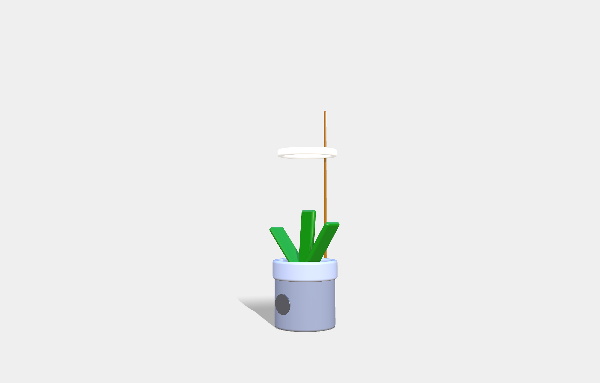

# SPOOKY
## Introduction
Spooky is a connected flower pot which permit to monitor his plant. You will be able to see your plant growing and interact with it.
With our application you see your plant health report and trigger some actions to help her to grow.

## How does it work
During the day, Spooky will measure the soil humidity and the luminosity. This informations will be sent to the server and a report is pushed to the user applciation.
If luminosity is insufficient, with the application you could turn on the lamp. Same thing if humidity is insufficient

## Useful links
https://www.tinkercad.com/things/1fQKKxhs0aV-spooky
https://app.vectary.com/p/5nQZdjbXwfkuwPJg74gJvM

## Electrical circuit

## 3D view

